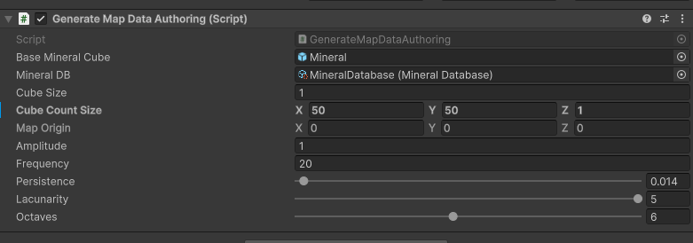

# MineralCubes

Mini project testing some cube types generated randomly by perlin noise

1. First define mineral data
{ width="800" height="600" style="display: block; margin: 0 auto" }

2. Configure map generator
{ width="800" height="600" style="display: block; margin: 0 auto" }

3. Generate!!!
{ width="800" height="600" style="display: block; margin: 0 auto" }
{ width="800" height="600" style="display: block; margin: 0 auto" }